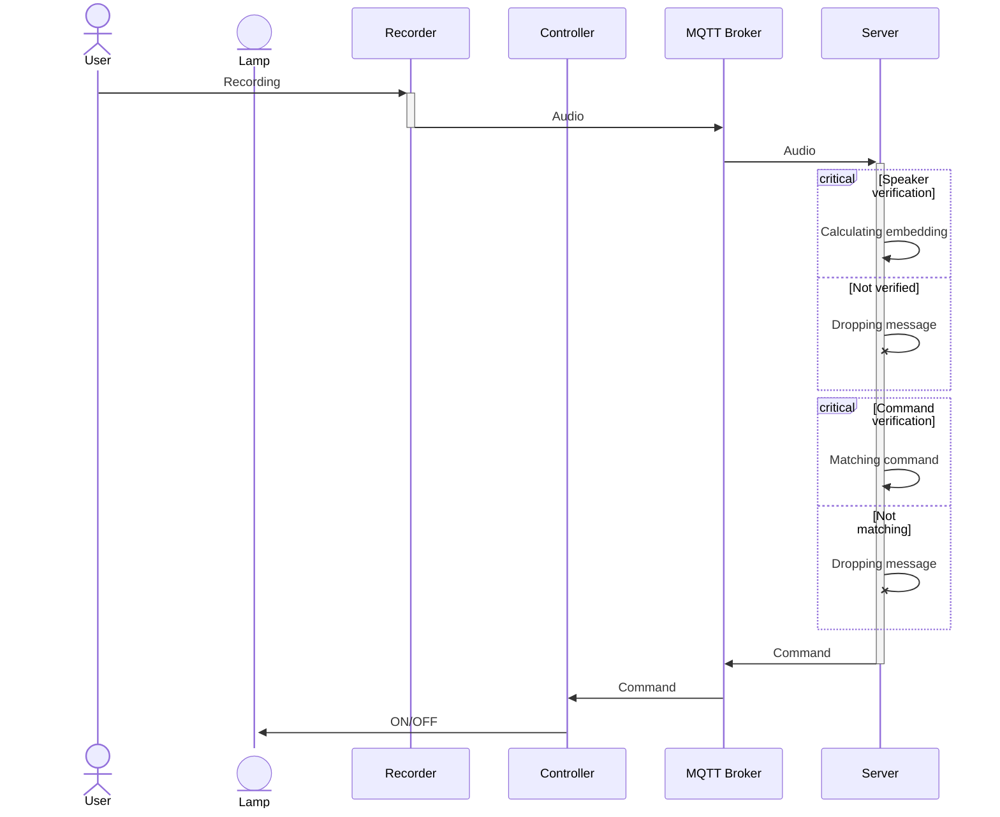

# Simple Audio Biometric System with ESP32

Built on top of PlatformIO and Uvicorn. 
A simple audio biometric system built with ESP32, INMP441, audio embedder, and transcriber.

## Components

On microcontroller side, ESP32 are used to collect and send audio recording, and control the end peripheral.
The code is based on [Arduino ESP-IDF](https://docs.espressif.com/projects/arduino-esp32/en/latest/index.html).
INMP441 is used as recording peripheral.

The server itself is driven by Python. 
FastAPI and MQTT client, are running on Uvicorn lifecycle and will act as the server to process
the recording and send appropriate command or drop the invalid recording.

### Recording

The data generated by INMP441 is 24-bit left-justified MSB, so there is a bit preprocessing involved 
before building the WAV. Even before that, I2S must be setup to accomodate those bits per sample, 
so we are using 32 bits per sample in the configuration. 

Each sample needs to be shifted and then written to the buffer. The recording process is also not
that straightforward since the system is ran on top of bare ESP32 without PSRAM so ~~it needs to write
to flash first before sending the audio~~.

The resulting audio is a Mono 8KHz sampled 24-bit WAV.

### Audio Transmission

~~Since the audio is stored in flash, the upload process is also done in chunking fashion, 
reading and sending 512 bytes per transmission.~~

The upload process is done while recording so this is probably only feasible in local network,
or assuming the WiFi interface store the buffer in flash fd. Obviously, chunking is the only way
to transmit the audio.

Some simple protocol is defined to allow this method of communication. 
So, the recorder will send chunks and the server will reassemble those chunks and do processing on it.
The server will obviously discard any partial or non-conforming packets.

### Audio Processing

For audio processing:
- ~~Speechbrain model `speechbrain/spkrec-ecapa-voxceleb` to embed the audio~~
- [Speaker-wavLM](https://huggingface.co/Orange/Speaker-wavLM-id) is used as the embedder, 
  which yield better result compared to Speechbrain's.
- OpenAI's Whisper to process transcription.

For now, the command matching process is pretty simple and naive, simply using diffing logic.
Though, it can be evolved into a more sophisticated version, by doing a single pass to LLM using [dspy](https://dspy.ai/),
skipping the transcribing process entirely:

```py
class Command(dspy.Signature):
  """
  Specify the command
  """

  audio: dspy.Audio = dspy.InputField()
  command: Literal["lamp_on", "lamp_off", "unknown"] = dspy.OutputField()

command = dspy.Predict(Command)

result = command(recording)
print(f"Command received: {result.command}")
```

Another alternative is to use transcription result as the input instead of the audio directly.

### MQTT Payload Format

```
MSG_TYPE | 4B           | message type
ID_SIZE  | 1B           | identifier size (in bytes)
ID       | ${ID_SIZE}B  | identifier
PAYLOAD  | REMAINING    | payload
```

The remaining constraints can be seen at [protocol.h](./src/mqtt/protocol.h).

### Configuration

Configuration is done via RemoteXY entirely, replacing the old serial configurer:
https://remotexy.com/en/editor/c53ea055e09450ce32a88346c34c5e33/

Though, the serial prompter code still exist in the codebase and can be reintegrated.

Aside from configuration, basic recording control & sampler is also provided.

## Sequence Flow



## Setup & Usage

It is recommended to start Mosquitto broker either by installing it as service
or using provided compose.

It is also recommended to use virtual environment. 
Run `python -m venv .venv`, then bootstrap the current terminal with venv.

After that, install python requirements by running `pip -r ./requirements`.

For the microcontrollers, flash the program using appropriate environment 
such as `recorder` for the recorder microcontroller 
and `controller` for the peripheral microcontroller.

### Quick Run

1. Start mosquitto MQTT broker server
2. Start server with `uvicorn src.server.main:app`
3. Setup wifi and mqtt, do verification, or take sample using RemoteXY.
4. The server should receive the recording, verifying it, then send command to controller if successful.
5. Swagger docs is also provided via http://localhost:8000/docs.
